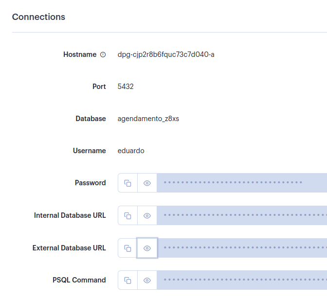

# Projeto Agendamento

## Criando um contêiner do banco
### Criar um arquivo Dockerfile

```c
FROM postgres:alpine
// Versao da imagem base

ENV POSTGRES_DB agendamento
ENV POSTGRES_USER eduardo
ENV POSTGRES_PASSWORD 12345

COPY init.sql /docker-entrypoint-initdb.d/
```
### Criar um arquivo init.sql

```sql
CREATE DATABASE agendamento;
CREATE USER eduardo WITH PASSWORD '12345';
ALTER ROLE eduardo SET client_encoding TO 'utf';
ALTER ROLE eduardo set timezone TO 'UTC-4';
GRANT ALL PRIVILEGES ON DATABASE agendamento TO eduardo;
```

#### Para criar uma imagem do banco de dados
Tem que estar na pasta do `Dockerfile`

```sql
sudo docker build -t agendamento $(pwd)
```
Por padrão todos os dados são armazenados internamento no container, quando parado, perde todos os arquivos. Sendo assim, utilizaremos um volume docker, essa pasta fica local na nossa máquina e é salvo os dados do conteiner. 

no `/` acesse a pasta `tmp` e crie o diretório `mkdir database` 

`/tmp/database` 

Caso seja necessário remover, utilizamos o `sudo su` e então o `rm -r /tmp/database`.

```sql
sudo docker run --name agendamento -p 5432:5432 -v /tmp/database:/var/lib/postgresql -e POSTGRES_PASSWORD=12345 -d agendamento:latest
```

Para iniciar o contêiner do banco:

```sql
sudo docker start agendamento
```

Para iniciar o terminal PSQL:

```sql
sudo docker exec -it agendamento psql -U eduardo -d agendamento
```
### Configurando o banco de dados

Crie um arquivo `application.properties` dentro da pasta `/scr/main/resources`

```sql
spring.jpa.properties.hibernate.dialect = org.hibernate.dialect.PostgreSQLDialect
# define a linguagem do banco (sql do postgres)
spring.jpa.hibernate.ddl-auto=update
# dessa forma sempre que iniciar o servico sera atualizado a tabela de acordo com a entidade
spring.jpa.hibernate.show-sql=true
# mostrar os comandos executados no console
spring.datasource.url=jdbc:postgresql://localhost:5432/agendamento
# servico do banco de dados
spring.datasource.username=eduardo
# usuario
spring.datasource.password=12345
# senha


spring.datasource.initialization-mode=always
spring.datasource.initialize=true
# reconfigura o banco sempre que o servico iniciar
spring.datasource.continue-on-error=true
# caso de erro no banco o servico continuara
```

Então até aqui temos um banco postgres em um contêiner rodando localmente na porta 5432 e a uma aplicação spring rodando localmente na porta 8080.


# Deploy da aplicação para nuvem
Para isso usaremos o [render.com](www.render.com) pelo fato de fornecer uso gratuito. 
Para isso precisaremos criar um contêiner da nossa API Spring.

### Criando um banco de dados Postgres no Render
Ao criar um banco de dados no Render, será nos gerado o `host, database, usuario e senha`. Devemos colocar essas informações la no `/scr/resources/application.properties`.


### Criando contêiner Spring
Configurando o Dockerfile
```dockerfile
FROM ubuntu:latest as build 
# utilizando o ubuntu como construção
RUN sudo apt-get update
# atualizar os repositórios
RUN sudo apt-get install openjdk-17-jdk maven -y
# instalando o JDK 17 (usar a versão correspondente do projeto)
# Também instala o Maven que é o que estou utilizando para fazer o gerenciamente de dependências.
WORKDIR /app 
# define o diretorio atual
COPY . .  
# copia todos arquivos do diretorio para o diretorio da imagem
RUN mvn clean package # constrói o projeto e cria o arquivo.jar

# ocorrendo tudo certo, temos um projeto compilado, construído e um arquivo.jar 
# agora iremos utilizar uma imagem JDK que é mais leve, para executar apenas o projeto construído

FROM openjdk:17-jdk-slim
# imagem final 
EXPOSE 8080 
# porta 
WORKDIR /app
COPY --from=build /app/target/agendamento-1.jar app.jar
# copia o arquivo .jar gerado pelo maven na etapa de construcao e chama de app.jar

ENTRYPOINT ["java", "-jar", "app.jar"]
# comandos que serão executar quando instanciado o contêiner
# java -jar app.jar
```
Com o Dockerfile devidamente configurado, já é possível criar um webservice no Render.